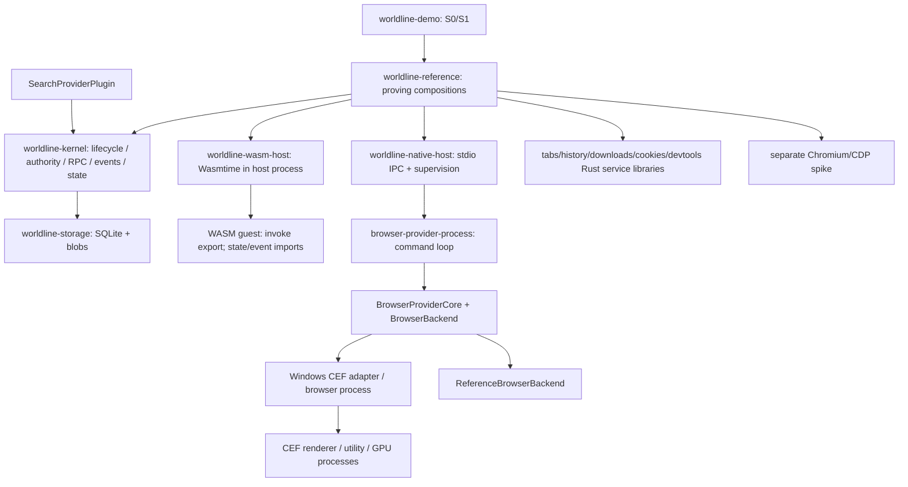
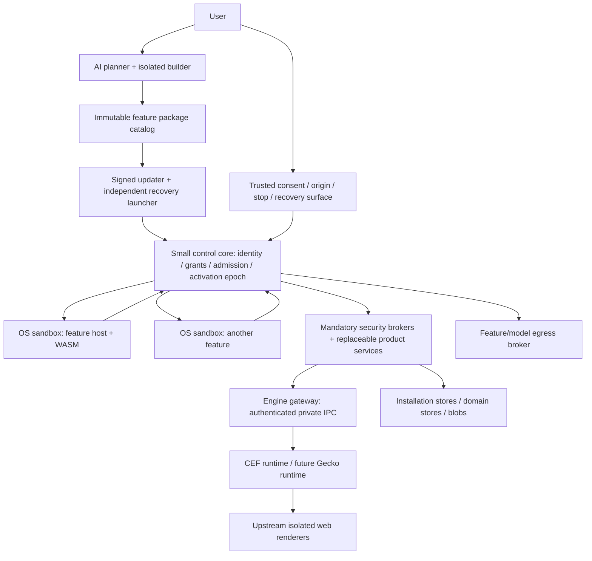
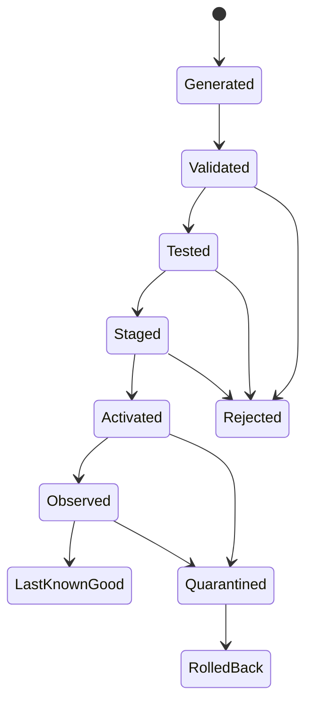

# Worldline vNext: фундаментальный архитектурный аудит

> Repository copy of the architecture audit dated 2026-09-06. It records the facts at `dfc644dfd6f6aa4335231b15bf0d5019a3c073fd`; later roadmap corrections do not retroactively change this evidence snapshot.

Дата: 6 сентября 2026. Исследован commit `dfc644dfd6f6aa4335231b15bf0d5019a3c073fd`. Статус документа: архитектурное предложение. Изменения реализации и принятых ADR не выполнялись.

## 1. Ответ на главный вопрос

**Да: пользователь и AI могут глубоко перепрограммировать браузер, если они программируют его поведение через ограниченные контракты. Нет: нельзя одновременно разрешить им произвольно менять механизмы доверия и обещать сохранение этих механизмов.**

Нужен небольшой Worldline control core, который пользовательские функции не могут подменить: identity, grants, проверка каждой привилегированной операции, запуск sandbox, проверка пакетов, переключение активной версии и восстановление. Вокруг него могут меняться навигационные сценарии, рабочие пространства, представление вкладок, панели, команды, правила обработки контента и автоматизации.

Однако **маленький Worldline kernel не означает маленький полный trusted computing base (TCB)**. Доверие к браузеру также опирается на ОС, engine browser process, IPC/FFI, sandbox runtime, обработку credentials, системный compositor/ввод и updater. Engine browser process, которому принадлежат cookies и профиль, способен читать эти данные независимо от grant внутри Rust kernel. Это ограничение модели, а не задача, решаемая ещё одним trait.

Текущий Worldline совместим с этой целью как **заготовка платформы с полезными работающими механизмами**. Он пока не реализует безопасную платформу глубоко изменяемых пользовательских функций. Самые серьёзные проблемы находятся между уже созданными слоями: browser services ↔ kernel authority, WASM ↔ browser capabilities, recovery models ↔ настоящий loader/storage/boot.

**Рекомендация: стратегия C, с первым поддерживаемым desktop runtime на Chromium/CEF.** Общими должны быть продуктовая семантика, capability/feature model и UI contracts. Паритет Chromium/Firefox не следует обещать. Переход к B допустим только после независимого Gecko spike и доказанной продуктовой отдачи.

## 2. Что в действительности построено

Стрелки показывают representative composition paths и зависимости, а не гарантию, что любой показанный вызов проходит kernel broker. В частности, S2 напрямую создаёт reference backend и вызывает provider core [E02]; реальные S3B bridges собраны в reference crate [E17].

| Слой | Факт реализации | Ограничение доказательства |
| --- | --- | --- |
| Generic kernel | Независимые identity/lifecycle, attenuated grants, default-deny admission, RPC/events/state; Cargo.toml без внешних зависимостей [E01], [E11] | Не является OS sandbox для произвольного native Rust |
| Builtin plugins | Rust `Plugin`/activation/capability contracts [E19] | Один address space и полномочия host process |
| Native host | Framed stdio, handshake, deadlines, child supervision; Windows Job Object [E05] | Job Object здесь завершает дерево процессов; не запрещает filesystem/network |
| WASM | Нет WASI imports; fuel/memory/component-size limits; два host imports [E04] | Гостевой вызов browser capabilities ещё не подключён |
| Browser API | Engine-free DTO, Worldline IDs, query bounds, ElementRef revision [E12] | Поддержка DTO не равна реализации операций |
| Browser provider | Generic dispatch + Reference backend + Windows CEF [E03], [E08] | Несколько важных CEF операций явно Unsupported |
| Browser services | Tab/history state models, downloads recovery, cookies metadata/value split, diagnostics [E09], [E10], [E22] | Большинство — Rust libraries; единый защищённый plugin entrypoint не установлен |
| Search | Есть настоящий `Plugin`, публикация resolve capability, отдельная navigation authority [E18] | Search change остаётся active; аудит его не закрывает |
| Storage | SQLite state/outbox и отдельный CAS blob store [E20] | Browser profiles, snapshots, kernel state и grants имеют разных владельцев |
| UI / AI | `UiLikeProvider` и `AgentLikePlugin` — probes [E15] | Нет реализованной пользовательской extensible shell и полноценного AI feature pipeline |
| Recovery | Upgrade/quarantine/safe-mode/bisect types и tests [E06], [E07] | Продуктовый boot/loader integration не доказан |

В workspace не обнаружены Gecko/Firefox backend, wgpu shell, Tauri shell или самостоятельный feature SDK для пользовательского программирования. Использование Rust bindings из репозитория `tauri-apps/cef-rs` не делает Worldline Tauri-приложением: в dependencies подключён crate `cef` [E14].

### Три пути, которые нельзя смешивать

1. S0/S1 доказывают generic composition и authority на reference families.
2. Chromium spike — отдельный эксперимент с настоящим Chromium. Его DOM/accessibility возможности не означают их наличие в production CEF adapter.
3. CEF provider даёт реальные browser callbacks/navigation/cookies/downloads/request-policy на Windows. В нём semantic query/actions/capture/permissions пока явно недоступны.

Свежие проверки: **93 локальных теста passed**, architecture guard passed; GRACE lint 0 errors, но GRACE status exit 1 с десятью linkage blockers. Полный scope и незапущенные проверки находятся в [EVIDENCE.md](<AI-NATIVE-BROWSER-AUDIT-EVIDENCE-2026-09-06.md>). Реальный CEF и hosted CI в этом аудите не запускались.

## 3. Архитектурные findings

Приоритеты ниже обозначают порядок устранения препятствий **перед допуском недоверенных пользовательских функций**. Это не CVSS и не перечень подтверждённых remotely exploitable vulnerabilities.

### F01 — P0. Объявленная готовность CEF превышает фактические операции

**Доказательство.** CEF `query` и `act` возвращают Unsupported [E03]; так же устроены permissions и capture [E08]. Provider handshake при этом объявляет `browser.query/v1`, `browser.act/v1`, `browser.permission/v1`, capture [E13]. S2, называемый live engine proving slice, создаёт `ReferenceBrowserBackend` [E02]. ROADMAP и verification projection говорят о полном выполнении соответствующего рубежа [E24].

**Следствие.** Планирование AI-native функциональности опирается на несуществующий production путь. Handshake не сообщает потребителю достоверную operation-level поддерживаемость.

**Решение.** Матрица операций для каждого backend/build/OS со статусами implemented, unsupported, experimental и ссылкой на реальный test. Unsupported — правильное поведение; удалить следует ложные обещания и неточные claims. Не подменять отсутствующую реализацию mock-ответом.

### F02 — P0. Browser service boundary ещё не замыкает capability enforcement

**Доказательство.** `TabsService` и `HistoryService` — структуры с Mutex/snapshot API [E09]. В tabs/history/downloads/cookies/devtools не обнаружены реализации `Plugin`/`CapabilityService`; reference compositions вызывают их напрямую. `CookiesService::get_cookie_value` проверяет context policy и selector, но не принимает authenticated caller/grant [E10]. BrowserProviderCore принимает contract/operation/JSON без InvocationContext [E21]. Search уже использует правильный plugin publication path [E18].

**Следствие.** Безопасный kernel и безопасно выглядящий service DTO ещё не образуют безопасную операцию. При прямом экспорте этих библиотечных методов AI-коду появляются обходы broker. Сейчас это host-only API и **не доказанный remote bypass**.

**Решение.** Сохранить domain libraries. Добавить один production gateway: authenticated session → runtime principal → operation/resource admission → domain validation → engine/storage. Методы, предполагающие доверенного caller, не публиковать напрямую. Проверять payload target против admitted resource; идентификатор сам по себе не authority.

### F03 — P0. Sandbox есть, browser-programming runtime ещё нет

**Доказательство.** WIT `world external-plugin` импортирует только state-access/event-publish. `capability-invoke` определён как будущий vocabulary, но не включён в world [E37]. Host linker предоставляет только эти два imports и отклоняет остальные. Fuel/memory/import-denial tests свежо прошли.

**Следствие.** Утверждение «плагин может безопасно перепрограммировать браузер» пока не подтверждено сквозным путём. Safe echo/provider не эквивалентен automation, потребляющей несколько browser capabilities.

**Решение.** Первым добавить ограниченный импорт вызовов по host-minted handles; затем один настоящий untrusted browser feature. Сохранить отсутствие ambient WASI. Не компенсировать нехватку API выдачей shell или полного DevTools.

### F04 — P0. Native provider не может быть обычным форматом AI-generated функции

**Доказательство.** Native supervisor запускает обычный процесс; containment включает KILL_ON_JOB_CLOSE [E05], [E40]. ADR прямо ограничивает обещание supervision, а не полноценным OS sandbox [E25]. WASM размещён в host address space [E04]. CEF bootstrap, напротив, требует ненулевой sandbox_info и включает upstream sandbox [E16].

**Следствие.** Native code, допущенный как trusted provider, имеет полномочия аккаунта процесса. IPC grants не ограничивают его прямой Win32/network вызов. Это свойство выбранной trust zone; пользовательская галочка «доверяю AI» не исправляет его.

**Решение.** Пользовательские функции — WASM/ограниченная декларативная модель внутри отдельного OS-restricted feature host. Native providers — отдельный installation class с независимым trust admission. Проверять actual token/handles/FS/network denial, а не наличие process ID. Engine renderer sandbox сохраняется.

### F05 — P0. Transactional upgrade/recovery пока в основном модель, не работающий updater

**Доказательство.** `UpgradeManager` хранит BTreeMap, принимает `is_compatible: bool`, возвращает новую revision/state [E06]. Call-site review не обнаружил подключения этого менеджера к Kernel loader; реальные потребители вне tests — chaos test child. Там commit_switch не сохраняет package revision в SQLite [E23]. `QuarantineManager` также только BTreeMap [E41]; safe-mode test проверяет boolean filter без загрузки shell [E07]. Отдельный kernel runtime restart/quarantine механизм существует [E26].

**Следствие.** Нельзя обещать переживающий crash rollback кода, durable revision quarantine или аварийный старт продукта. Тестовые имена «persistent»/«boots» не доказывают соответствующий lifecycle.

**Решение.** Durable package catalog, atomic generation pointer, actual code loader, activation handshake, grant epoch switch, crash-restart test в новом процессе. Бисект оставить диагностическим алгоритмом до появления безопасной test composition. Сохранить state-machine как основу реализации.

### F06 — P0. Admission-only revocation недостаточен для агентных побочных эффектов

**Доказательство.** Существующий acceptance test специально утверждает: уже admitted invocation завершается после revoke [E11]. Lifetime имеет Persistent/Lifecycle, time-based expiration сознательно исключён [E27]. Page resource и ElementRef не задают совместную origin/frame/epoch политику [E12].

**Следствие.** «Остановить агента» сейчас нельзя честно интерпретировать как запрет ещё не совершившейся отправки/записи в уже допущенном вызове. Page-scoped право может быть шире ожидаемого пользователем после навигации. Stale-element guard полезен, но не заменяет origin authority.

**Решение.** Для новых effectful contracts — короткие leases, resource/document/frame binding, cancellation и повторная проверка epoch непосредственно перед commit/dispatch. Завершённое внешнее действие остаётся завершённым. Не менять старую семантику молча: отдельный contract/version и независимое принятие нового invariant.

### F07 — P0. Trusted UI и recovery surface не определены реализацией

**Доказательство.** `UiLikeProvider` возвращает строковый результат и публикует fixture observation [E15]. CEF создаёт popup proving window [E28]. ROADMAP M1.4 оставляет shell/composition будущей работой [E39].

**Следствие.** Полностью сменяемый UI без неподменяемого канала consent позволяет feature рисовать фальшивые permission prompts, скрывать origin, перехватывать ввод и лишать пользователя аварийного выключения.

**Решение.** Маленькая security surface входит в обязательную доверенную composition: origin identity, grant dialog, action approval, stop/recovery. Она может поставляться отдельным системным компонентом, но не заменяется обычной feature authority. Остальной UI расширяется.

### F08 — P1. Engine-neutral типы пока не доказывают engine portability

**Доказательство.** Единственный production adapter — Windows CEF; инициализация иных платформ явно unavailable [E14], [E29]. Второй backend является reference model. BrowserBackend включает navigation, cookies, storage, permissions, capture и native-devtools в одном большом интерфейсе [E30].

**Следствие.** Вы уже имеете полезную anti-corruption boundary, но не доказанную common platform. Стоимость Gecko нельзя оценивать по числу строк ещё одного impl.

**Решение.** Общий product API, раздельные operation profiles, engine-specific extensions. Не создавать равноправный второй runtime до получения независимого feasibility evidence.

### F09 — P1. У abstraction layer есть опасные «успешные» деградации

**Доказательство.** Default request-policy setters ничего не делают. Cookie 0.2 default адаптируется в 0.1, несмотря на комментарий о security-relevant host-only/domain semantics [E30]. CEF overrides исправляют этот случай для своего backend.

**Следствие.** Новый backend может скомпилироваться и утратить гарантии, которые consumer считает подключёнными. Это latent contract risk, а не доказательство ошибки текущего CEF cookie path.

**Решение.** `Unsupported` для непредоставленной гарантии; negotiation возвращает точные semantics и coverage. Security-sensitive downgrade запрещён. Простой общий интерфейс нужно получать исключением ложных обещаний, а не default no-op.

### F10 — P1. Request-policy callback не является общей сетью платформы

**Доказательство.** CEF on_before_resource_load синхронно обращается к policy transport; default budget 250 ms; optional adblock допускает FailOpen [E31], [E32]. Контракт намеренно содержит Allow/Block, без body/headers/credentials.

**Следствие.** Полезный adblock hook нельзя превращать в boundary для всех исходящих данных, consent или LLM inference. Вызов AI на каждом сетевом callback увеличивает latency и связывает доступность browsing с доступностью модели. FailOpen допустим для optional adblock, но не для обязательного запрета утечки.

**Решение.** Компилировать правила заранее; исполнять bounded deterministic rules рядом с engine. Разделить page networking, feature networking и model egress. Для mandatory security policy — независимый enforcement с FailClosed и покрытием redirects/workers/других каналов.

### F11 — P1. Download/blob data plane пока ограничен small-fixture масштабом

**Доказательство.** CEF completion читает весь файл через `std::fs::read` [E33]. Provider пересылает весь Vec в одном JSON BlobRequest [E34]; host framed transport имеет ограничение, в реальном S3B 4 MiB [E17], [E35].

**Следствие.** Large downloads создают неограниченную относительно размера файла аллокацию и могут превысить frame limit. Exact size зависит от JSON encoding, но файл больше 4 MiB заведомо не уместится в такой frame. Small fixture не доказывает пригодность browser download subsystem.

**Решение.** Bounded streaming/chunks, backpressure, quota, cancellation, incremental digest, ownership-bound blob handle. Blob ID — content identity, а не право читать. Подключить выдачу read authority к одному broker; текущий BlobReadBroker — отдельный host helper [E36].

### F12 — P1. Durable engineering state расходится с runtime и semantic linkage

**Доказательство.** ROADMAP/verification заявляют больше, чем CEF/recovery реализации [E24]. Свежий GRACE status не находит governed implementation links ни у одного модуля; lint при этом проходит. History/tabs имеют snapshot export/import, что само по себе не устанавливает durable product owner [E09], [E22].

**Следствие.** AI-агенты будут строить дальнейшие изменения на неверной карте готовности. Это ускоряет накопление несовместимых контрактов и повторных «закрытий» отсутствующих путей.

**Решение.** Reconciliation change для точных claims и file-local links. Для каждой публичной гарантии — named owner, production entrypoint, failure semantics, свежая проверка. Исправление карты не заменяет реализацию отсутствующего пути.

## 4. Попытка опровергнуть продуктовую гипотезу

| Сильное утверждение | Результат проверки | Жизнеспособная формулировка |
| --- | --- | --- |
| Всё выше небольшого kernel равноценно недоверенно | Опровергнуто: engine host, credential broker, updater и trusted UI сохраняют привилегии | Продуктовая роль не даёт скрытых прав; системные trust roles явны и проверяемы |
| Любая часть браузера может быть изменена AI | Несовместимо с сохранением trusted boundary | AI меняет features внутри заданной модели; TCB меняется через отдельный release workflow |
| Набор capability names обеспечивает безопасность | Опровергается отсутствующими enforcement links F02 | Каждый native effect имеет принудительный reference monitor |
| Один BrowserBackend позволяет взаимозаменяемость Chromium/Firefox | Не доказано, и полная equivalence практически непригодна | Portable workflows плюс negotiation и backend-specific paths |
| Rollback вернёт систему в прошлое | Неверно для отправленной сети, раскрытого секрета, объекта на сервере | Local activation rollback; external effects имеют отдельный журнал и reconciliation |
| AI review/test может гарантировать правильность generated кода | Не может покрыть произвольный код/сеть/все состояния | Ограничение полномочий и ущерба действует даже после ошибочного принятия кода |
| WASM делает любой host API безопасным | Неверно: host imports могут выдать всю authority | Малый import surface, OS defense in depth и broker enforcement |

Глубина программируемости не должна измеряться числом доступных внутренних объектов. Она измеряется числом полезных сценариев, создаваемых без изменения TCB: вертикальные вкладки, рабочие пространства, собственные команды, extraction transforms, origin-scoped page augmentations, download routing, research pipelines, локальные индексы, согласованные действия нескольких features.

Есть неизбежный предел: функция, которой разрешено прочитать произвольные страницы и отправить произвольные байты любому серверу, способна их утечь даже при идеальном sandbox. Нужно ограничивать **совместно источник данных и получателя**, а не только системные вызовы.

## 5. Chromium / Firefox и стратегии A, B, C

CEF даёт поддерживаемую embedding поверхность и binaries для desktop; потоки, окна, render/network callbacks всё равно требуют специфической интеграции. Это аргумент за практический первый CEF backend. [CEF general usage](https://chromiumembedded.github.io/cef/general_usage.html)

Официальный GeckoView ориентирован на Android. Это не доказательство невозможности desktop Gecko, но документация не даёт эквивалентного drop-in desktop CEF пути. Варианты desktop Gecko — Firefox-derived runtime либо отдельный Firefox с automation bridge; их нужно оценивать как разные продукты интеграции. [GeckoView](https://mozilla.github.io/geckoview/)

WebDriver BiDi полезен для общей automation vocabulary и части тестов. Он не определяет browser chrome compositor, updater, embedding ABI или Worldline permission model. Firefox развивает BiDi/Marionette; его Remote Agent обладает широким session control, включая cookies. Выдавать такой канал generated feature напрямую нельзя. [W3C BiDi](https://w3c.github.io/webdriver-bidi/), [Firefox protocols](https://firefox-source-docs.mozilla.org/remote/index.html), [Remote Agent security](https://firefox-source-docs.mozilla.org/remote/Security.html)

### Сравнение стратегий

| Критерий | A. Chromium-first platform | B. Common browser platform | C. Portable product, engine-specific runtime |
| --- | --- | --- | --- |
| Первый качественный desktop продукт | Самый прямой путь | Замедляется из-за второго runtime и normalization | Почти путь A, если portable слой узкий |
| Глубокая интеграция | Лучший доступ к Chromium-specific возможностям | Ограничение общей частью или растущая эмуляция | Полная глубина через explicit engine extensions |
| Стоимость сопровождения | Один engine train; риск зависимости от upstream | Два engine trains плюс общая semantic compatibility | Один сейчас; второй только для доказанных сценариев |
| API для авторов features | Удобен, но легко протекает Chromium | Простой на поверхности, сложный в исключениях | Core operations + supported profiles + явные extensions |
| Переносимость данных/сценариев | Требует отдельной дисциплины | Обязательство полного паритета часто ложно | Основная цель |
| Update security | Самая короткая матрица | Одна интеграция может задержать общую поддержку | Engine updates независимы; affected feature отключается локально |
| Различия desktop/mobile | Могут потребовать иной продукт | Особенно дорогая общность | Допускаются разные runtime assemblies |
| Вердикт сейчас | Реалистичная запасная стратегия | **Не принимать** | **Принять как target** |

C не обязывает написать Firefox adapter сейчас. C означает, что history/bookmarks/feature packages/UI intent не хранят CDP handles, а потребители не вызывают raw CEF. Она допускает несколько несовпадающих engine profiles.

### Почему B сейчас экономически не оправдана

По коду нет ни второго production adapter, ни полноценного первого AI feature path. Дополнительная работа B не сводится к mapping названий: нужен второй embedding/launch lifecycle, security/update integration, rendering/input/accessibility слой, storage/profile lifecycle, diagnostics, release validation и разбор semantic differences. Эта работа сохраняется при идеальном общем trait.

Нижняя иллюстрация verification matrix: `engines × OS × supported engine builds × critical scenarios`. Для 1 × 3 × 2 × 6 это 36 комбинаций, для 2 × 3 × 2 × 6 — 72, ещё без GPU, accessibility, privacy modes и feature interactions. Это **арифметический пример, не оценка человеко-месяцев**. Тесты можно автоматизировать, ответственность за обновления и различия от этого не исчезает.

Доказать отрицательный финансовый ROI без размера команды, engine-dependent customer demand и стоимости сопровождения невозможно. Однако текущая база не даёт оснований платить цену B: переносимость behavioural API не проверена даже между двумя реальными backend, а продуктовая гипотеза ещё не прошла один untrusted feature. Отсутствие этих данных — основание ограничить инвестицию, а не объявлять Gecko технически невозможным.

Второй engine допускается после независимого, ограниченного по времени spike: 10–15 инженерных дней как **предлагаемый budget**, существующий maintainer, embedding + input/IME + accessibility + separate profile + crash containment + update rehearsal. Stop: для выбранного пути требуется постоянный глубокий Firefox fork без владельца, отключение sandbox, перенос unsafe authority в общий API или невозможна поддержка security updates. Успех spike открывает отдельное решение; не означает обещания parity.

### Что оставлять engine-specific

| Область | Общая семантика, которую стоит иметь | Что нельзя честно обещать одинаковым |
| --- | --- | --- |
| Navigation | Attempt ID, requested/committed URL, typed terminal outcome | Точный порядок внутренних load/redirect/process/BFCache событий |
| DOM/AX | Bounded snapshot, semantic locator, stale handle error | Полное одинаковое accessibility tree, node IDs, shadow/OOPIF behavior, input implementation |
| Scripts | Origin/frame scope, isolated execution intent, explicit main-world risk | Эквивалентность JS worlds/Xray wrappers и object bridging |
| Networking | Restrictive declarative policy, bounded observation | Все callback stages, response-body interception, proxy/auth, SW/cache semantics |
| Profiles | Logical profile identity и portable user data | Общие raw profile directories, cookie/storage schema, extension databases |
| Rendering/UI | Surface lifetime, viewport, resize, focus, accessibility intent | Shared texture format, GPU synchronization, compositor scheduling, native menu integration |
| DevTools | Safe diagnostics DTO | Raw CDP/RDP/Marionette, debugger/evaluate, tracing and heap internals |
| Devices/media | Product policy and approved request | DRM/CDM availability, codec/device hooks, platform entitlements |
| Extensions | Feature package model Worldline | Полная совместимость Chrome/Firefox extension ecosystem |

Mozilla документирует несовместимые proxy/sidebar APIs и различия content-script worlds. Firefox response filtering и Chrome declarative network rules — разные поверхности; ограничения extension API не следует автоматически приписывать native CEF. Они показывают, что даже гораздо более узкий слой WebExtensions не даёт полной семантической эквивалентности. [MDN incompatibilities](https://developer.mozilla.org/en-US/docs/Mozilla/Add-ons/WebExtensions/Chrome_incompatibilities), [Firefox filterResponseData](https://developer.mozilla.org/en-US/docs/Mozilla/Add-ons/WebExtensions/API/webRequest/filterResponseData), [Chrome declarativeNetRequest](https://developer.chrome.com/docs/extensions/reference/api/declarativeNetRequest)

## 6. Target architecture Worldline vNext

**Trusted control core** — generic identity, handle tables, grant attenuation/revocation, bounded RPC, process/session binding, installation-state binding, activation generations. В нём нет TabBar, prompts модели, search provider ranking или adblock rule semantics. Часть обновления и recovery может быть отдельным исполняемым модулем; доверенная граница от этого не исчезает.

**Mandatory security brokers** — domain-aware проверка origin/frame/action, секретов, файлов, egress и UI consent. Их можно реализовать вне kernel и обновлять отдельно, но boot composition обязана включать проверенную версию. Произвольный plugin не может подменить credential broker путём объявления более подходящей capability.

**Engine adapter** — приватный translator с минимальным набором административных прав, собственным protocol/version/profile. Browser engine сохраняет владение web platform enforcement: SOP, CORS, CSP, site isolation, cookies, TLS и renderer sandbox. Worldline не реализует второй браузерный security engine поверх него.

**Feature runtime** — загрузчик immutable package, lifecycle, state namespace, quotas, event subscriptions и capability calls. Первые внешние executable features — WASM Components. Разные функции принадлежат разным principals. Native/system providers — отдельный класс; одинаковый RPC protocol не означает одинаковый уровень доверия.

**AI-generated code runtime** — тот же недоверенный feature runtime после activation. Модель не получает особых прав. Генерация/компиляция проходят в отдельном build sandbox без пользовательского профиля, credentials, signing keys и ambient network. Build scripts и зависимости также считаются исполняемым недоверенным кодом; registry resolution фиксируется lock/digest и выполняется отдельным контролируемым шагом.

**Sandbox** — WASM isolation плюс OS boundary вокруг feature host. Windows: проверяемый restricted token/AppContainer-профиль, explicit inherited handles, process/resource limits; Linux: проверяемая комбинация namespace/seccomp/filesystem/network restrictions; macOS: поддерживаемая platform sandbox/entitlements модель после отдельного spike. Ни одна платформа не получает скрытый permissive fallback. Job Objects продолжают отвечать за cleanup. AppContainer действительно ограничивает ресурсы; точный набор прав конкретного feature host нужно доказать тестами. [Microsoft AppContainer](https://learn.microsoft.com/en-us/windows/win32/secauthz/appcontainer-isolation)

Fuel ограничивает выполнение guest instructions, но не заменяет wall-clock deadline host call, лимиты компиляции, число инстансов или общий бюджет приложения. Wasmtime/runtime и host imports остаются частью TCB; процессная изоляция уменьшает последствия их дефекта. [Wasmtime security](https://docs.wasmtime.dev/security.html)

**Process boundaries.** Минимально: recovery/updater; control/brokers; engine browser process и upstream children; недоверенный feature host; renderer UI feature при необходимости. На старте отдельный feature host на installation — простая проверяемая модель. Pooling допустим позже только с доказанной изоляцией authority и resource accounting. Process-per-function-per-tab заранее не нужен. Отдельный engine process/profile для повышенно чувствительной privacy partition полезен, но цена измеряется; два ContextId внутри одного engine process не обеспечивают изоляции при компрометации этого процесса.

**State/storage.** InstallationId владеет durable state; RuntimeId/epoch — живой authority. History/bookmarks/workspaces/feature configuration имеют portable domain schemas. Engine-owned cookies/cache/IndexedDB остаются в приватном профиле конкретного engine. Blob store выдаёт scoped handles, streams и retention references; content hash не служит bearer credential. Backup включает явный inventory metadata/blobs и правила доступа; engine secrets не экспортируются автоматически.

**Networking boundary.** Web page traffic обслуживается engine network stack. Feature HTTP идёт через egress broker без ambient cookies. Model egress — самостоятельная capability с названным provider/endpoint и разрешёнными категориями данных. Browser service-worker/cache/WebSocket/WebRTC pathways требуют явной coverage matrix. Отдельное разрешение нужно для localhost/private-network targets; canonical URL, redirect и DNS-rebinding проверки выполняются в фактическом сетевом consumer. Нельзя считать любой HTTP GET безвредным или гарантировать отсутствие server-side effects только по HTTP method.

**Crash containment.** Падение feature прекращает её calls/subscriptions/UI slots; control surface и обычная навигация продолжаются. Crash engine создаёт typed unavailable и инвалидирует живые page/element handles; восстановление вкладки не переиспользует старую authority. Renderer crash не должен становиться рестартом всего браузера. Browser process compromise остаётся серьёзной угрозой профилю даже при живом kernel.

## 7. Capability/permission model

Эффективное право — пересечение:

`user consent ∩ installation grants ∩ runtime delegation ∩ operation scope ∩ resource scope ∩ current policy ∩ supported engine guarantee`.

Manifest содержит **запрос** прав. Импорт API, discovery, подпись пакета, имя plugin или уверенность AI прав не выдают. Principals приходят из authenticated channel/session binding. Нельзя принимать caller identity из JSON.

У grant должны быть: issuing authority; installation/runtime/activation epoch; operation/version; target profile/context; origin/site policy; page/frame/document при необходимости; data category; allowed destination; delegation bound; expiration/usage limit; revocation status. Не все поля нужны каждой операции — generic kernel хранит общую authority, domain broker проверяет browser semantics.

Пример будущего права: «прочитать текст выбранного top-level document на example.test один раз до ближайшей навигации, вернуть только в локальную панель». Это существенно безопаснее `browser.query:any`. Для передачи того же текста модели требуется отдельный egress grant. Cross-origin iframe не наследует разрешение top-level origin.

Capability delegation ослабляет права. Для цепочки A → B нужно передавать необходимую часть authority A; если B использует собственные более сильные rights, это отдельный защищённый workflow со своим consent. Grants у двух сговорившихся features не следует оценивать изолированно: передача данных между ними также является boundary.

Разрешение прочитать данные не может технически заставить произвольный код «забыть» уже полученные байты. Поэтому declassification/вывод данных — отдельное решение, а revoke останавливает последующее использование host capabilities. Логи, UI, clipboard, exports и LLM prompts — такие же возможные получатели.

### Что получает пользовательская функция

| Объект | Разрешённый интерфейс | Обязательный enforcement / предел |
| --- | --- | --- |
| Tabs/windows | List/create/select/group/move/close через typed service; UI representation отделено от engine PageId | По умолчанию собственные/явно выбранные resources; enumerating других вкладок раскрывает данные. Tab close и page destruction имеют разные явные semantics |
| Navigation | Navigate/reload/back/stop с attempt ID и typed outcome | Scheme/origin/profile checks, redirects, current grant epoch; internal/file/browser-control URLs недоступны обычной feature |
| Network requests | Declarative restrictions; scoped metadata; отдельный feature fetch | Не raw sockets; отдельные permissions для authenticated fetch, headers, body, private networks; baseline prohibitions не ослабляются |
| DOM/page content | Bounded snapshots, semantic locators, scoped transformations/actions | Проверка page/frame/origin/document при исполнении; отдельное разрешение на sensitive fields и main-world script; нет CEF/V8 pointers |
| Downloads | Создать download intent; progress; cancel; completed artifact handle | Staging owned by broker; quotas/streaming/content checks; export/save через trusted picker; execution файла — отдельный запрет по умолчанию |
| Filesystem | File/directory handles от picker, scoped read/write/export | OS-handle based access, no ambient paths; symlink/reparse/TOCTOU handling в broker; никакого доступа к profile database или runtime packages |
| Credentials | Origin-bound fill/use/sign/authenticate с коротким токеном | Секреты/HttpOnly cookies/key material не возвращаются generated коду; native vault/engine owns use. Export — отдельный административный путь |
| History/bookmarks | Bounded queries и mutations domain API | Installation/profile scope, retention/privacy; bulk export/delete отдельно; incognito не становится durable history или AI memory |
| UI | Commands, slots, panels, themes/tokens, reactive view models | Namespaced resources; focus/input/hit-testing/quota rules; запрет имитации/перекрытия trusted consent/origin/recovery |
| Engine APIs | Curated engine-neutral operations; opt-in supported engine extensions | Raw CDP/RDP/CEF/Marionette channel обычной feature не выдаётся; privileged diagnostics — отдельная trusted tool |
| AI/model | Input selection + explicit inference capability | Provider, data scope, budget, retention intent; page instructions не могут выдавать authority или менять approval |
| Feature composition | Typed messages/data handles и attenuated capability delegation | Dependencies не дают транзитивных прав; data transfer имеет provenance и recipient policy |

Secret fill тоже не магическая защита: если feature может после fill прочитать или исполнять произвольный код в том же credential-bearing document, она может получить секрет. Для sensitive use broker ограничивает совместимые grants/режим, либо использует механизм, где reusable secret не выдаётся странице. WebAuthn/credential operations требуют origin-bound engine/native workflow; обычная feature не выбирает произвольный signing challenge и origin без контроля.

Принципиально недоступны generated runtime: shell/произвольный process execution, native dynamic loading, raw syscall/FFI, grant issuance, signing keys, updater configuration, disabled sandbox, прямой profile/credential store, unrestricted debugger, управление trusted UI, чтение чужого installation state и подмена activation pointer. Пользователь как владелец ОС может вручную форкнуть браузер, но такой fork уже не несёт прежнюю trust guarantee.

## 8. UI composition без потери доверия

Предлагаются три пространства: **trusted security surface**, **product shell surfaces**, **page content**. Разделение enforced compositor/input routing, а не CSS convention.

Продуктовая shell собирается из slots: navigation controls, tab views, workspace switcher, sidebars, command palette, status/action panels. Feature публикует декларативный view tree или sandboxed surface с contract limits. Host сохраняет z-order boundaries, clipping, focus, keyboard routing, accessibility tree namespace и resource accounting.

Origin и identity, permission/approval prompt, indication активного захвата/агентного действия и recovery command остаются в trusted surface. Пользователь может менять внешний вид в заданных пределах, но content не способен выдать себя за этот канал. Accessibility/IME, high-DPI, drag/drop, clipboard и full-screen — часть security/input contract, а не последующее украшение. В full-screen должен сохраняться понятный выход и способ увидеть текущую origin/authority.

Composition изменения атомарны на уровне generation: новый набор slots проверяется, затем заменяет старый; конфликт shortcuts, циклическая dependency или неисправный panel не уничтожает исходную shell. Отказ renderer feature закрывает её slot. Даже при повреждённой пользовательской layout configuration recovery launcher открывает встроенный экран отключения/восстановления.

Собственный GPU compositor/OSR не стоит выбирать заранее. Первый spike сравнивает native surface embedding и минимальный compositor по input latency, accessibility, IME, DPI и failover. Glass effect из roadmap не может требовать отключения isolation или блокировать создание working shell.

## 9. Transactional modification: что действительно транзакционно

Да, модель возможна для **локальной активации кода и его состояния**:

| Шаг | Проверяемый результат |
| --- | --- |
| Generate | New immutable revision + исходник + locked dependencies; никакой записи поверх активного пакета |
| Validate | Package digest/provenance, schema/import allowlist, requested-rights diff, forbidden APIs, resource/complexity limits |
| Test | Disposable sandbox + fixture profiles; реальные browser operations для критичных claims; adversarial inputs и независимые acceptance tests |
| Stage | Copy-on-write state namespace; migration без network/credentials; compatibility check выполняет host, а не bool от feature |
| Activate | Durable prepare record; остановка новых calls старого epoch; drain/cancel; atomic catalog pointer для code digest/state generation/policy revision; новые runtime handles |
| Monitor | Внешний watchdog: latency, resource use, denied calls, crashes, missing progress; feature self-report не единственный health source |
| Rollback | Закрыть новый epoch/процесс; вернуть проверенную code/state generation; записать durable quarantine и typed incomplete effects |
| Promote LKG | После внешней проверки и достаточного observation window сохранить поколение как good; success callback функции сам её не принимает |

Во время переключения у каждой изменяемой state generation ровно один writer. Если concurrent updates нельзя согласовать через CAS/epoch, activation откладывается. Старый процесс не получает доступ к новому state только потому, что InstallationId тот же.

**Внешний мир не включается в ACID transaction браузера.** Отправленное письмо, HTTP request, purchase, загрузка файла на сервер или раскрытие cookie не откатываются заменой WASM. Для них нужны prepare/approve/dispatch/outcome, bounded approvals, idempotency при поддержке получателя и reconciliation после unknown outcome. Автоматический повтор при неизвестном результате запрещён. Само `click` тоже может совершить действие на сервере.

Rollback состояния способен потерять данные, созданные после активации. Поэтому нужны forward-compatible records, migration journal/перенос совместимых записей либо явный выбор recovery point пользователем. Browser engine profile нельзя автоматически открыть старой версией engine после необратимой schema migration. Инкогнито и открытые authenticated sessions не следует клонировать в test sandbox.

## 10. Update, API и capability versioning

Версионировать независимо:

- **Package revision** — immutable digest кода, dependencies, build provenance.
- **Feature API** — stable major/minor с формализованной семантикой, не только DTO.
- **Capability/permission semantics** — operations, scopes, lifetime, data disclosure, delegated rights; добавление нового права требует нового consent.
- **Runtime ABI/WIT/IPC** — отдельная negotiated compatibility.
- **Domain state schema** — миграция и recovery compatibility.
- **Engine build + adapter profile** — допустимые сочетания engine/adapter/OS и реализованные guarantees.
- **UI schema/slots** — stable lifecycle, layout/accessibility contracts; не ABI внутренних widgets.

Stable minor не расширяет существующий grant, не меняет скрытно origin или side-effect semantics. Новые обязательные права требуют отключения affected feature до consent; отсутствие согласия не блокирует security update браузера. Experimental API не получает N/N-1/N-2 promise автоматически.

Долговечность созданных функций достигается адаптацией на границе Worldline, package validation до запуска и contract tests. Нельзя гарантировать вечную совместимость с произвольной внутренней CEF функцией или live site DOM. Для web automation отдельно измеряется устойчивость к изменению сайта.

Core/engine и features обновляются разными release lanes. Security patch core/engine имеет приоритет над несовместимой optional feature: её можно отключить, сохранив данные и explanation. Old engine pin не служит бессрочной мерой совместимости. Update metadata должно аутентифицировать digest, version/security floor, target/expiry и разрешённый rollback; old signed metadata не должно обеспечивать downgrade ниже security floor.

CEF уже поддерживает versioned stable API/ABI в определённых диапазонах; утверждение, что любой engine update обязательно требует полной перекомпиляции, устарело. Но CEF отдельно предупреждает, что ABI compatibility не гарантирует behavioral compatibility, а experimental API имеет более тесную связь с конкретным build. Для pinned Rust bindings Worldline нужно проверить выбранный API mode и реальные сочетания сборок. [CEF API versioning](https://chromiumembedded.github.io/cef/api_versioning.html)

Не переключать DLL работающего engine процесса. Stage и validate bundle, затем restart безопасной engine session с recovery данных. Updater и recovery launcher должны запускаться при неисправной основной feature composition; обычная feature не владеет их каналом обновления.

## 11. Testing, observability и failure containment

Проверка строится вокруг **одного реального вертикального сценария**, а не расширения числа DTO.

Первый сценарий: пользователь устанавливает сгенерированную функцию, которая читает явно выбранную страницу, преобразует данные и показывает свою панель; отдельным разрешением делает scoped navigation или сохраняет выбранный artifact. Затем функция заменяется новой revision и намеренно падает. Обычная навигация, trusted stop и recovery продолжают работать; после нового запуска host возвращается к проверенной revision.

Необходимые gates:

| Gate | Критерий |
| --- | --- |
| Authority | Нет grant — executor не вызван; payload нельзя заменить на другой context/page/frame/origin; provider routing не меняет получателя секрета |
| Revocation | После revoke не начинается новый commit effect; queued/in-flight outcomes определены и проверены |
| Resource containment | Infinite loop, memory pressure, compile bomb, host-call stall, event flood и cumulative CPU не блокируют core |
| Web attack surfaces | Cross-origin frames, redirects, BFCache, stale handles, navigation races, malicious DOM и prompt injection не расширяют authority |
| Real engine | Query/action/capture/permissions проверяются на CEF executable, а не reference backend; Unsupported проверяется явно |
| Persistence/activation | Kill на каждом durable step; новый host process обнаруживает единственное активное поколение; старые handles не действуют |
| UI | Feature не рисует поверх consent, не крадёт focus/keys из protected surface, не убирает recovery; accessibility/IME проверены |
| Engine update | Representative sites, cookies/profile migration, downloads, GPU/software fallback и sandbox health на candidate engine |
| Supply chain | Tampered digest/manifest, revoked package, unsafe dependency и permission expansion отклоняются до активации |

Не все gates уже пройдены. Текущие 93 теста подтверждают лишь указанную часть foundations.

Observability: installation ID, revision digest, RuntimeId/epoch, operation, outcome, reason code, duration/bytes, redaction/truncation/drop counters, causal links. URL queries, DOM, prompts, cookie values, keystrokes не должны попадать в общую telemetry. Диагностический capture данных — отдельное временное право с понятным storage/retention. Crash dumps могут содержать секреты и не отправляются автоматически.

Watchdog живёт вне feature; budget accounting суммируется по installation и приложению. Canary activation сначала действует в локальном preview/test profile. Автобисект не выполняет реальные внешние side effects и не «доказывает виновность» одного plugin при взаимодействиях нескольких.

## 12. Extension, plugin, automation, feature и изменение браузера

| Термин | Рабочее определение | Trust implication |
| --- | --- | --- |
| Extension | Distribution/installation unit пользовательского кода или UI | По умолчанию untrusted; capabilities выдаются отдельно |
| Plugin | Реализация capability provider/consumer с lifecycle | Может быть system/native/WASM; слово plugin ничего не говорит о trust |
| Automation | Сценарий последовательности разрешённых действий | Не отдельный superuser; authority связана с задачей и ресурсами |
| Browser feature | Product behavior из одного или нескольких providers, state и UI surfaces | Может глубоко менять workflow, оставаясь в public feature model |
| Изменение браузера | Замена TCB, privileged broker, engine integration, updater или security semantics | Reviewed release/change bundle, вне пользовательского feature runtime |

Эта классификация допускает, что одна extension поставляет несколько features и automation recipes. Она не требует разных transport stacks для каждого термина.

## 13. Неприкосновенные архитектурные инварианты

1. Идентичность процесса/runtime выдаёт host; payload, model output и package name её не создают.
2. Ни одна привилегированная операция не обходит authenticated broker и domain target validation.
3. Grants default-deny; delegation только сужает authority. Discovery и совместимость не дают прав.
4. Runtime epoch прекращает действовать при replacement/revoke/crash; persistent state не наследует runtime authority.
5. Security-sensitive effects повторно проверяют актуальную authority в точке исполнения; неизвестный внешний outcome не повторяется автоматически.
6. Page content, AI output и generated code не могут менять grants, policy floor, package trust, sandbox или approval.
7. Renderer isolation/SOP/CSP/CORS/TLS не отключаются ради feature, теста или engine portability.
8. Raw credentials и reusable secrets не выдаются обычному generated runtime; secret use и data egress независимы.
9. Engine/profile/internal paths и native objects не входят в пользовательский feature ABI.
10. Trusted consent/origin/stop/recovery surface не подменяется и не перекрывается пользовательской composition.
11. У каждого пакета immutable revision, у state один активный writer generation, у активации durable atomic selection.
12. Recovery и security updates работают независимо от optional features; compatibility не разрешает бессрочно удерживать уязвимый engine.
13. RPC, event observation и persistence сохраняют разные semantics. Event delivery не подтверждает command success и не создаёт durable record автоматически.
14. Код из разных trust zones не получает одинаковые ambient права из-за одинакового plugin interface.
15. Бюджеты применяются к compilation, memory, CPU, host calls, UI, storage, network и совокупному потреблению.
16. Unsupported/security downgrade всегда явны. Если guarantee не реализована, интерфейс её не рекламирует.
17. Incognito/sensitive data не попадают автоматически в history, AI memory, telemetry, test snapshots или exports.
18. Ни AI, ни implementation worker не меняет acceptance test, чтобы оправдать нарушение invariant; scaffolded/wired/verified не смешиваются.

## 14. Сохранить, переделать, удалить из production contract

| Сохранить | Переделать/достроить | Удалить/не публиковать |
| --- | --- | --- |
| Generic Rust kernel и направление зависимостей | Production browser service gateways | Claims о verified CEF features, которые Unsupported |
| Installation/runtime/lifecycle separation | Origin/frame/epoch-aware authority и эффектные leases | Default no-op для обязательных security guarantees |
| RPC отдельно от events и storage | Реальный durable activation/recovery | Выдачу raw engine/debugger интерфейсов ordinary features |
| Attenuation, default-deny, metadata-only trajectory | OS-contained feature host и WASM capability import | Идею, что native process автоматически является sandbox |
| WIT/IPC, deny-all ambient WASI и quotas | Operation-level engine support negotiation | Runtime версии «API существует, значит backend умеет» |
| SQLite/CAS и selected audit/outbox | Domain storage ownership и blob streaming | Обязательство full engine parity до второго spike |
| Typed DTO, stale references, explicit Unsupported | Trusted shell и bounded composition | Raw profile format как общий portable state |
| Search resolve/navigation separation | Package signature/provenance + security update floor | Обещание rollback внешнего мира |
| S0/S1 и реальные proving fixtures как regressions | GRACE factual/semantic linkage | Публикацию test-only/reference helpers как production extension API |

«Удалить» здесь — архитектурная рекомендация для будущего change; код в этом аудите не удалялся. Reference models и probes сохраняются как явно обозначенные fixtures.

## 15. Migration roadmap и backlog

Этапы следуют зависимостям, а не календарному обещанию. Каждый implementation этап требует собственной принятой spec/plan; текущий документ не изменяет approved search plan.

| Этап | Результат | Acceptance / stop criterion |
| --- | --- | --- |
| G0. Вернуть карту к фактам | Operation matrix, TCB inventory, revised readiness claims, GRACE links | Реальная CEF операция и reference-only path различимы машинно; status linkage errors разобраны |
| G1. Замкнуть одну authority boundary | Browser gateway + scoped grants + небольшой trusted permission/stop surface | Untrusted caller доходит до реального navigation/observation только через kernel; другие resources denied |
| G2. Доказать программируемость | WASM capability import + OS-contained feature host + одна полезная generated feature | Ни native escape hatch, ни изменение core не нужны; intentional crash/loop не ломает browsing |
| G3. Реализовать transactional activation | Immutable package catalog, durable code/state pointer, revoke epochs, real loader + LKG boot | Kill/restart в каждом переходе; новый процесс boot восстанавливает правильную revision |
| G4. Расширить product shell | Slots, scoped commands, plugin panels, layout recovery, accessibility/IME | Два конфликтующих/сломанных UI features не ломают protected UI и ввод |
| G5. Доказать эксплуатацию | Engine update rehearsal, data migration, observability/privacy, streaming downloads | Security engine update проходит с отключением incompatible optional feature; данные сохранены |
| G6. Решить судьбу второго engine | Ограниченный Gecko/Firefox spike на выбранной платформе | Продуктовая необходимость + maintainable embedding + sandbox/update/input evidence; иначе остановить |

G1–G3 важнее расширения каталога browser services. «Глубокая программируемость» должна быть доказана существующим пользовательским сценарием до проектирования marketplace.

| NOW | NEXT | LATER | DO NOT DO |
| --- | --- | --- | --- |
| F01/F02/F03/F05: исправить claims и спроектировать один защищённый feature path | Durable activation/recovery и trust UI | Gecko-derived runtime при выполнении G6 | Паритет Firefox/Chromium как обязательство v1 |
| Operation support matrix на CEF, реальный DOM/action bridge | Origin/frame/epoch permissions, user activation tokens | Другие frontend languages/SDK | Arbitrary native code с обычным «permission prompt» |
| TCB inventory и разделение system/native/user classes | OS sandbox verification, global budgets | Marketplace и signing/delegation infrastructure для сторонних издателей | Raw CDP/CEF/RDP в generated runtime |
| Named owner для resource validation и sensitive sinks | Bounded UI slots, compatibility fixtures | Advanced network policy и engine extensions | AI вызов в синхронном per-request hot path |
| Один реальный untrusted feature proving slice | Blob streaming, reliable package update lane | Rich cross-feature data composition | Общий raw engine profile или полное global event sourcing |
| Сохранить S0/S1; разобрать GRACE linkage | Fresh-process crash/restart gates | Исследование нескольких engine security partitions | Отключение sandbox/защиты для прохождения тестов |

### Решения, которые могут закрыть путь через 1–2 года

- Public ABI с CEF/CDP pointers, process IDs и backend node IDs заставит авторов функций зависеть от engine internals.
- Native-first user plugins сформируют экосистему с ambient authority, которую трудно перевести в sandbox без массовых поломок.
- Persistent grants, привязанные только к plugin name, затруднят revocation при обновлениях/подмене кода.
- «Все плагины одинаковы» без protected system composition сделает trusted consent и recovery заменяемыми.
- Shared writable profile/database между engine и всеми features разрушит ownership и isolation.
- In-place code/state migrations без retained generation сделают безопасный rollback недостижимым.
- Engine versions, зафиксированные пользовательскими features навсегда, превратят compatibility в препятствие security updates.
- Выбор своего compositor до IME/accessibility/embedding spike создаст дорогую зависимость от графического pipeline.
- Принятие model tests за product evidence приведёт к ещё большему объёму архитектуры, существующей только в документах.

### Хорошие идеи, которые пока следует отложить

Полный multi-engine runtime; универсальный browser object model; весь WASI; JS/Python/Rust SDK одновременно; собственный compositor; zero-copy/shared-memory protocol повсюду; распределённый plugin scheduler; global event-sourced browser; marketplace; автономный AI, меняющий собственный permission policy; одновременный hot-swap engine внутри живой сессии; автоматический bisect на настоящем пользовательском профиле; полная эмуляция Chrome/Firefox extensions.

Причина отсрочки конкретна: пока не доказан минимальный замкнутый путь `untrusted package → scoped authority → useful browser operation → replace → recover`. Новые горизонтальные abstractions не устраняют этот риск.

## 16. Покрытие вопросов пользователя

| Вопрос | Где дан ответ |
| --- | --- |
| 1. Совместимость текущей архитектуры | §1–4; findings F01–F07 |
| 2. Реалистичность нескольких движков | §5, economics и G6 |
| 3. Граница trusted core | §1, §6, §13 |
| 4. Разрешённое/недоступное AI/user functionality | §7, §12–13 |
| 5. Capability/permission model | §7, F02/F06 |
| 6. Isolation/process/privilege separation | §6, F04, отдельный threat-model |
| 7. Все перечисленные browser surfaces | Полная таблица §7 |
| 8. UI composition | §8 |
| 9. Обновления core/engine/features | §9–10 |
| 10. API/capability versioning | §10 |
| 11. Обнаружение/откат неправильной feature | §9, §11 |
| 12. Transactional modification model | §9 и явные ограничения rollback |
| 13. Extension/plugin/automation/feature/browser | §12 |
| 14. Engine-specific возможности | Таблица §5 |
| 15. Реальная engine/framework привязка | §2, F08/F09 |
| 16. Опасные решения на 1–2 года | §15 |
| 17. Ложные/преждевременные abstractions | F01/F03/F05/F09, §14–15 |
| 18. Сохранить/переделать/удалить | §14 |

Отдельные документы: [Threat model](<THREAT-MODEL-AI-NATIVE-BROWSER-2026-09-06.md>), [проект ADR](<../adr/ADR-WORLDLINE-VNEXT.md>), [пакет доказательств](<AI-NATIVE-BROWSER-AUDIT-EVIDENCE-2026-09-06.md>). Следующий архитектурный decision gate — принятие или корректировка проекта ADR; рефакторинг не начат.

## Доказательства из кода

## Приложение. Привязка доказательств к коду

- [E01] — `crates/worldline-kernel/Cargo.toml:1`
- [E02] — `crates/worldline-reference/src/s2.rs:44`
- [E03] — `crates/worldline-browser-cef/src/backend.rs:2380`
- [E04] — `crates/worldline-wasm-host/src/adapter.rs:310`
- [E05] — `crates/worldline-native-host/src/supervisor.rs:85`
- [E06] — `crates/worldline-kernel/src/upgrade.rs:220`
- [E07] — `crates/worldline-kernel/tests/upgrade_acceptance.rs:249`
- [E08] — `crates/worldline-browser-cef/src/backend.rs:2513`
- [E09] — `crates/worldline-browser-tabs/src/service.rs:17`
- [E10] — `crates/worldline-browser-cookies/src/service.rs:448`
- [E11] — `crates/worldline-kernel/tests/security_acceptance.rs:1435`
- [E12] — `crates/worldline-browser-contract/src/identity.rs:164`
- [E13] — `crates/worldline-browser-provider-process/src/lib.rs:446`
- [E14] — `crates/worldline-browser-cef/Cargo.toml:18`
- [E15] — `crates/worldline-reference/src/ui_like.rs:87`
- [E16] — `crates/worldline-browser-cef/src/ffi.rs:167`
- [E17] — `crates/worldline-reference/src/s3b.rs:1004`
- [E18] — `crates/worldline-browser-search/src/plugin.rs:40`
- [E19] — `crates/worldline-kernel/src/plugin.rs:164`
- [E20] — `crates/worldline-storage/src/sqlite.rs:307`
- [E21] — `crates/worldline-browser-provider/src/core.rs:147`
- [E22] — `crates/worldline-browser-history/src/service.rs:15`
- [E23] — `crates/worldline-storage/src/bin/upgrade-chaos-child.rs:85`
- [E24] — `ROADMAP.md:23`
- [E25] — `docs/adr/ADR-EXTERNAL-PLUGIN-BOUNDARY-V1.md:298`
- [E26] — `crates/worldline-kernel/src/kernel.rs:2924`
- [E27] — `crates/worldline-kernel/src/security.rs:423`
- [E28] — `crates/worldline-browser-cef/src/backend.rs:1039`
- [E29] — `crates/worldline-browser-cef/src/loop_runner.rs:63`
- [E30] — `crates/worldline-browser-provider/src/backend.rs:35`
- [E31] — `crates/worldline-browser-cef/src/backend.rs:542`
- [E32] — `crates/worldline-browser-contract/src/request_policy.rs:34`
- [E33] — `crates/worldline-browser-cef/src/backend.rs:878`
- [E34] — `crates/worldline-browser-provider-process/src/lib.rs:730`
- [E35] — `crates/worldline-native-host/src/codec.rs:87`
- [E36] — `crates/worldline-storage/src/blob.rs:265`
- [E37] — `crates/worldline-plugin-protocol/wit/worldline-plugin.wit:66`
- [E38] — `.grace/verification/main.xml:172`
- [E39] — `ROADMAP.md:716`
- [E40] — `crates/worldline-native-host/src/containment.rs:35`
- [E41] — `crates/worldline-kernel/src/quarantine.rs:63`

[E01]: <../../crates/worldline-kernel/Cargo.toml#L1>
[E02]: <../../crates/worldline-reference/src/s2.rs#L44>
[E03]: <../../crates/worldline-browser-cef/src/backend.rs#L2380>
[E04]: <../../crates/worldline-wasm-host/src/adapter.rs#L310>
[E05]: <../../crates/worldline-native-host/src/supervisor.rs#L85>
[E06]: <../../crates/worldline-kernel/src/upgrade.rs#L220>
[E07]: <../../crates/worldline-kernel/tests/upgrade_acceptance.rs#L249>
[E08]: <../../crates/worldline-browser-cef/src/backend.rs#L2513>
[E09]: <../../crates/worldline-browser-tabs/src/service.rs#L17>
[E10]: <../../crates/worldline-browser-cookies/src/service.rs#L448>
[E11]: <../../crates/worldline-kernel/tests/security_acceptance.rs#L1435>
[E12]: <../../crates/worldline-browser-contract/src/identity.rs#L164>
[E13]: <../../crates/worldline-browser-provider-process/src/lib.rs#L446>
[E14]: <../../crates/worldline-browser-cef/Cargo.toml#L18>
[E15]: <../../crates/worldline-reference/src/ui_like.rs#L87>
[E16]: <../../crates/worldline-browser-cef/src/ffi.rs#L167>
[E17]: <../../crates/worldline-reference/src/s3b.rs#L1004>
[E18]: <../../crates/worldline-browser-search/src/plugin.rs#L40>
[E19]: <../../crates/worldline-kernel/src/plugin.rs#L164>
[E20]: <../../crates/worldline-storage/src/sqlite.rs#L307>
[E21]: <../../crates/worldline-browser-provider/src/core.rs#L147>
[E22]: <../../crates/worldline-browser-history/src/service.rs#L15>
[E23]: <../../crates/worldline-storage/src/bin/upgrade-chaos-child.rs#L85>
[E24]: https://github.com/Artemyx-DataScientist/Worldline/blob/dfc644dfd6f6aa4335231b15bf0d5019a3c073fd/ROADMAP.md#L23
[E25]: <../../docs/adr/ADR-EXTERNAL-PLUGIN-BOUNDARY-V1.md#L298>
[E26]: <../../crates/worldline-kernel/src/kernel.rs#L2924>
[E27]: <../../crates/worldline-kernel/src/security.rs#L423>
[E28]: <../../crates/worldline-browser-cef/src/backend.rs#L1039>
[E29]: <../../crates/worldline-browser-cef/src/loop_runner.rs#L63>
[E30]: <../../crates/worldline-browser-provider/src/backend.rs#L35>
[E31]: <../../crates/worldline-browser-cef/src/backend.rs#L542>
[E32]: <../../crates/worldline-browser-contract/src/request_policy.rs#L34>
[E33]: <../../crates/worldline-browser-cef/src/backend.rs#L878>
[E34]: <../../crates/worldline-browser-provider-process/src/lib.rs#L730>
[E35]: <../../crates/worldline-native-host/src/codec.rs#L87>
[E36]: <../../crates/worldline-storage/src/blob.rs#L265>
[E37]: <../../crates/worldline-plugin-protocol/wit/worldline-plugin.wit#L66>
[E38]: <../../.grace/verification/main.xml#L172>
[E39]: https://github.com/Artemyx-DataScientist/Worldline/blob/dfc644dfd6f6aa4335231b15bf0d5019a3c073fd/ROADMAP.md#L716
[E40]: <../../crates/worldline-native-host/src/containment.rs#L35>
[E41]: <../../crates/worldline-kernel/src/quarantine.rs#L63>
