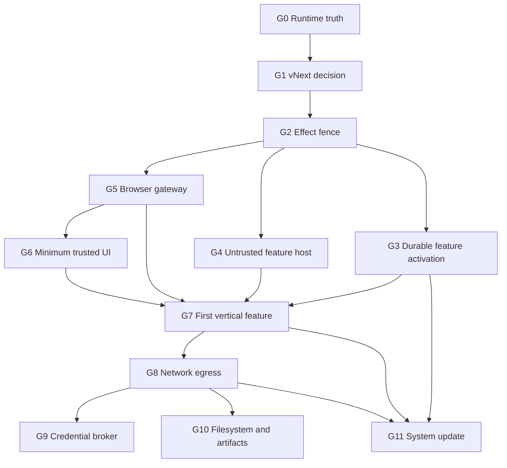

# Worldline vNext GRACE package index

Статус: draft package set for owner review. Ни один package не approved, plan.xml не создан, implementation не разрешён.

Редакция 2026-09-07 учитывает архитектурное review Sol: revoke/commit теперь требует линейной границы, feature rollback получил политику сохранения новых данных, первый полезный vertical slice перенесён перед широкими I/O и update работами, а прежний общий I/O draft разделён по независимым доверительным границам.

- Операция: ARCH-VNEXT-COMPLIANCE-PACKAGES-20260906
- Authority mode: codex_led
- Operation root and architecture owner: Sol
- Acceptance owner: user
- Baseline branch: codex/vnext-architecture-compliance-specs-20260906 from d1303f5

Источники решения:

- [Astra architecture audit](AUDIT-AI-NATIVE-BROWSER-2026-09-06.md)
- [Astra threat model](THREAT-MODEL-AI-NATIVE-BROWSER-2026-09-06.md)
- [Audit evidence](AI-NATIVE-BROWSER-AUDIT-EVIDENCE-2026-09-06.md)
- [Proposed vNext ADR](../adr/ADR-WORLDLINE-VNEXT.md)
- [Integration delta ledger](INTEGRATION-DELTA-LEDGER-2026-09-06.md)
- [Roadmap](../../ROADMAP.md)

## Package map

| Gate | Draft change | Audit coverage | Depends on | Architectural outcome |
| --- | --- | --- | --- | --- |
| G0 | [C-VNEXT-RUNTIME-TRUTH-RECONCILIATION-20260906](../../.grace/changes/active/C-VNEXT-RUNTIME-TRUTH-RECONCILIATION-20260906/spec.xml) | F12, readiness drift, 10 GRACE linkage blockers | None | Honest support matrix, TCB/resource map, linked graph and verification |
| G1 | [C-VNEXT-ARCHITECTURE-DECISION-20260906](../../.grace/changes/active/C-VNEXT-ARCHITECTURE-DECISION-20260906/spec.xml) | F08, multi-engine economics, false abstractions | G0 applied | Strategy C accepted or corrected; CEF-first, explicit engine profiles and version domains |
| G2 | [C-KERNEL-EFFECT-FENCE-REVOCATION-20260906](../../.grace/changes/active/C-KERNEL-EFFECT-FENCE-REVOCATION-20260906/spec.xml) | F06 | G1 applied | Revocation and commit or dispatch authorization have one trusted linearization order |
| G3 | [C-PLATFORM-DURABLE-PACKAGE-ACTIVATION-20260906](../../.grace/changes/active/C-PLATFORM-DURABLE-PACKAGE-ACTIVATION-20260906/spec.xml) | Feature-activation part of F05 | G2 applied | Immutable feature catalog, atomic generation, loss-aware LastKnownGood rollback and recovery boot |
| G4 | [C-PLATFORM-UNTRUSTED-FEATURE-HOST-20260906](../../.grace/changes/active/C-PLATFORM-UNTRUSTED-FEATURE-HOST-20260906/spec.xml) | F03, F04 | G2 applied; G3 contract approved and applied before activation | WASM feature ABI in an OS-restricted host with no ambient authority |
| G5 | [C-BROWSER-CAPABILITY-GATEWAY-CONFINEMENT-20260906](../../.grace/changes/active/C-BROWSER-CAPABILITY-GATEWAY-CONFINEMENT-20260906/spec.xml) | F01, F02, F09 | G1, G2 applied | Truthful CEF profile with required real navigation, observation, query and typed action through one browser gateway |
| G6 | [C-UI-TRUSTED-COMPOSITION-RUNTIME-20260906](../../.grace/changes/active/C-UI-TRUSTED-COMPOSITION-RUNTIME-20260906/spec.xml) | Minimum of F07 and UI spoofing threats | G1, G5 applied | Protected origin, consent, stop and recovery surfaces plus one bounded sidebar slot |
| G7 | [C-FEATURE-TRANSACTIONAL-ACTIVATION-SLICE-20260906](../../.grace/changes/active/C-FEATURE-TRANSACTIONAL-ACTIVATION-SLICE-20260906/spec.xml) | Core product hypothesis; composition of the F01 through F07 mitigations | G3 through G6 applied | First ordinary generated feature completes generate to rollback on real CEF without broad I/O authority |
| G8 | [C-PLATFORM-NETWORK-EGRESS-CONFINEMENT-20260907](../../.grace/changes/active/C-PLATFORM-NETWORK-EGRESS-CONFINEMENT-20260907/spec.xml) | F10 and network exfiltration paths | G7 applied | Separately enforced browser, feature, updater, model, integration and service egress planes |
| G9 | [C-PLATFORM-CREDENTIAL-BROKER-20260907](../../.grace/changes/active/C-PLATFORM-CREDENTIAL-BROKER-20260907/spec.xml) | Credential theft and confused-deputy threats | G8 applied | Non-exportable operation-scoped credential authority |
| G10 | [C-PLATFORM-FILESYSTEM-ARTIFACT-BOUNDARY-20260907](../../.grace/changes/active/C-PLATFORM-FILESYSTEM-ARTIFACT-BOUNDARY-20260907/spec.xml) | F11, path escape and resource exhaustion | G8 applied | Opaque portals plus bounded streaming download and artifact data plane |
| G11 | [C-SYSTEM-UPDATE-COMPATIBILITY-20260907](../../.grace/changes/active/C-SYSTEM-UPDATE-COMPATIBILITY-20260907/spec.xml) | System-update part of F05 | G3, G7, G8 applied | Isolated authenticated core/engine updater, compatibility quarantine and bootable fallback |

## Dependency trajectory

G3, G4, and G5 may be planned as separate bounded changes after G2; G4 cannot activate untrusted code before G3 is applied. G6 proves only the protected geometry and one sidebar slot required by G7. G7 is the first point at which the product hypothesis may be called verified. G8 through G11 expand operational depth only after that evidence and therefore cannot postpone the first falsification test.

## Approval waves

1. Approve and plan G0 only. Reconcile runtime truth and GRACE linkage before treating any later assumptions as current.
2. Review the G0 result, then approve G1. G1 is the architecture authority for all later packages.
3. Approve and apply G2 with deterministic before-and-after linearization races.
4. Revalidate and approve G3, G4, and G5 as separate changes. Their plans may overlap in time only after contracts and observed write scopes prove independence; G4 cannot activate untrusted code before G3 is applied.
5. Approve the minimum G6 trusted surface and then G7. G7 must exercise the real G3 through G6 path and is the go or stop gate for the product hypothesis.
6. Only after G7 succeeds, approve G8 and G10 according to demonstrated product needs. Approve G9 only after G8, and G11 after G3, G7, and G8.

Spec approval does not approve a plan. Each approved spec receives a separate immutable GraceChangePlan through grace-plan and a separate explicit plan approval.

## Cross-package invariants

- Kernel contains generic identity, capability admission, epochs, lifecycle, messaging and state-binding mechanisms, never browser, model, UI, provider or workspace policy.
- Event bus is not RPC and cannot decide an invocation result, permission, activation, or effect commit.
- Installation identity and durable state outlive runtime identity and authority.
- Ordinary generated code cannot execute as native code or access ambient filesystem, network, process, credentials, engine internals, updater or recovery authority.
- Every privileged effect is admitted by capability and ordered against revocation at a trusted sink-side linearization point; a check followed by an independently scheduled effect is insufficient.
- Unsupported engine operations are explicit and cannot be advertised, silently downgraded, or replaced with a no-op.
- Recovery and trusted stop do not depend on optional feature code.
- Protected UI state is rendered from host-owned identity and policy, never feature-provided labels.
- Local rollback never claims to undo an external effect that may already have escaped.
- Automatic local rollback never silently discards an acknowledged user-visible write; incompatible state requires an explicit recovery decision.
- Reference and model tests never replace real CEF, OS isolation, fresh-process, hosted, accessibility, or manual-product evidence.

## Explicit deferrals

- No Firefox or Gecko runtime package is created. A later bounded spike requires product demand, maintained embedding, update ownership, and isolation evidence.
- No marketplace, public plugin registry, native user-code format, universal replay engine, arbitrary debugger access, or full browser fork is proposed.
- No complete UI slot catalog, custom compositor, universal network proxy, or zero-copy artifact protocol is selected before measured evidence from G7 and the later bounded packages.
- No implementation package is merged from the existing composite branch as one undifferentiated change.
- The active approved C-BROWSER-SEARCH-PROVIDERS-20260904 bundle remains unchanged and must complete or be superseded through its own lifecycle.

## Dirty-tree coexistence

At package drafting time, scripts/Maintain-CargoCache.ps1 existed as unrelated untracked drift. It is outside every draft package, was not read as authority, and must remain untouched by later plans unless the user opens a separate change.

## Review decision

The immediate approval question remains G0 only: whether C-VNEXT-RUNTIME-TRUTH-RECONCILIATION-20260906 accurately defines the required current-state reconciliation. The remaining eleven specs are draft trajectory proposals and must be revalidated against G0 evidence before approval. The deleted C-PLATFORM-BROKERED-IO-BOUNDARIES-20260906 draft was never approved and is replaced by G8 through G11; its git history remains the audit trail.
