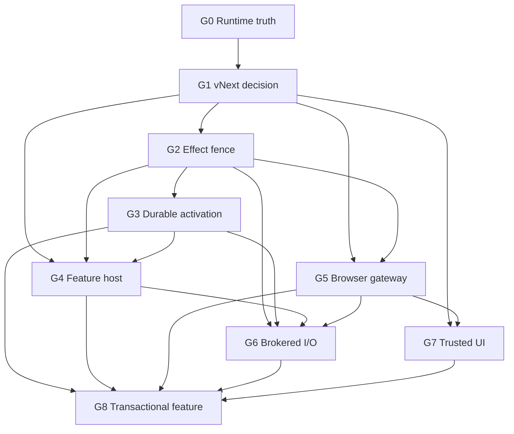

# Worldline vNext GRACE package index

Статус: draft package set for owner review. Ни один package не approved, plan.xml не создан, implementation не разрешён.

- Операция: ARCH-VNEXT-COMPLIANCE-PACKAGES-20260906
- Authority mode: codex_led
- Operation root and architecture owner: Sol
- Acceptance owner: user
- Baseline branch: codex/vnext-architecture-compliance-specs-20260906 from d1303f5

Источники решения:

- [Astra architecture audit](AUDIT-AI-NATIVE-BROWSER-2026-09-06.md)
- [Astra threat model](THREAT-MODEL-AI-NATIVE-BROWSER-2026-09-06.md)
- [Audit evidence](AI-NATIVE-BROWSER-AUDIT-EVIDENCE-2026-09-06.md)
- [Proposed vNext ADR](../adr/ADR-WORLDLINE-VNEXT.md)
- [Integration delta ledger](INTEGRATION-DELTA-LEDGER-2026-09-06.md)
- [Roadmap](../../ROADMAP.md)

## Package map

| Gate | Draft change | Audit coverage | Depends on | Architectural outcome |
| --- | --- | --- | --- | --- |
| G0 | C-VNEXT-RUNTIME-TRUTH-RECONCILIATION-20260906 | F12, readiness drift, 10 GRACE linkage blockers | None | Honest support matrix, TCB/resource map, linked graph and verification |
| G1 | C-VNEXT-ARCHITECTURE-DECISION-20260906 | F08, multi-engine economics, false abstractions | G0 applied | Strategy C accepted or corrected; CEF-first, explicit engine profiles and version domains |
| G2 | C-KERNEL-EFFECT-FENCE-REVOCATION-20260906 | F06 | G1 applied | Revocation and epoch changes stop future privileged commits |
| G3 | C-PLATFORM-DURABLE-PACKAGE-ACTIVATION-20260906 | F05 | G2 applied | Immutable package catalog, trusted core/engine updater, atomic generation, LastKnownGood and recovery boot |
| G4 | C-PLATFORM-UNTRUSTED-FEATURE-HOST-20260906 | F03, F04 | G1, G2, G3 applied | WASM feature ABI in an OS-restricted host with no ambient authority |
| G5 | C-BROWSER-CAPABILITY-GATEWAY-CONFINEMENT-20260906 | F01, F02, F09 | G1, G2 applied | Truthful operation profile and one mandatory browser effect gateway |
| G6 | C-PLATFORM-BROKERED-IO-BOUNDARIES-20260906 | F10, F11 and exfiltration threat paths | G2 through G5 contracts | Separate network, credential, filesystem, download and streaming brokers |
| G7 | C-UI-TRUSTED-COMPOSITION-RUNTIME-20260906 | F07 and UI spoofing threat paths | G1, G5 applied | Protected system chrome with bounded feature slots and trusted stop/recovery |
| G8 | C-FEATURE-TRANSACTIONAL-ACTIVATION-SLICE-20260906 | Product hypothesis and questions 1 through 18 | G0 through G7 applied | One ordinary generated feature completes generate to rollback on real CEF |

## Dependency trajectory

G5 may be implemented for trusted callers while G3 and G4 proceed, but it cannot be exposed to ordinary generated features until G4 isolation and G3 durable activation are applied. G6 starts only after the physical enforcement points of G4 and G5 are known. G8 is the first point at which the product hypothesis may be called verified.

## Approval waves

1. Approve and plan G0 only. Reconcile runtime truth and GRACE linkage before treating any later assumptions as current.
2. Review the G0 result, then approve G1. G1 is the architecture authority for all later packages.
3. Approve G2, then G3. These establish effect and recovery invariants before untrusted execution.
4. Approve G4 and G5 as separate plans; they may execute in parallel only if their observed write scopes and contracts do not overlap.
5. Approve G6 and G7 after the gateway and host boundaries are stable.
6. Approve G8 only after every predecessor has fresh accepted evidence.

Spec approval does not approve a plan. Each approved spec receives a separate immutable GraceChangePlan through grace-plan and a separate explicit plan approval.

## Cross-package invariants

- Kernel contains generic identity, capability admission, epochs, lifecycle, messaging and state-binding mechanisms, never browser, model, UI, provider or workspace policy.
- Event bus is not RPC and cannot decide an invocation result, permission, activation, or effect commit.
- Installation identity and durable state outlive runtime identity and authority.
- Ordinary generated code cannot execute as native code or access ambient filesystem, network, process, credentials, engine internals, updater or recovery authority.
- Every privileged effect is admitted by capability and revalidated at its actual sink against resource target and activation epoch.
- Unsupported engine operations are explicit and cannot be advertised, silently downgraded, or replaced with a no-op.
- Recovery and trusted stop do not depend on optional feature code.
- Protected UI state is rendered from host-owned identity and policy, never feature-provided labels.
- Local rollback never claims to undo an external effect that may already have escaped.
- Reference and model tests never replace real CEF, OS isolation, fresh-process, hosted, accessibility, or manual-product evidence.

## Explicit deferrals

- No Firefox or Gecko runtime package is created. A later bounded spike requires product demand, maintained embedding, update ownership, and isolation evidence.
- No marketplace, public plugin registry, native user-code format, universal replay engine, arbitrary debugger access, or full browser fork is proposed.
- No implementation package is merged from the existing composite branch as one undifferentiated change.
- The active approved C-BROWSER-SEARCH-PROVIDERS-20260904 bundle remains unchanged and must complete or be superseded through its own lifecycle.

## Dirty-tree coexistence

At package drafting time, scripts/Maintain-CargoCache.ps1 existed as unrelated untracked drift. It is outside every draft package, was not read as authority, and must remain untouched by later plans unless the user opens a separate change.

## Review decision

The immediate approval question is G0 only: whether C-VNEXT-RUNTIME-TRUTH-RECONCILIATION-20260906 accurately defines the required current-state reconciliation. The remaining eight specs are draft trajectory proposals and should be revalidated against G0 evidence before approval.
